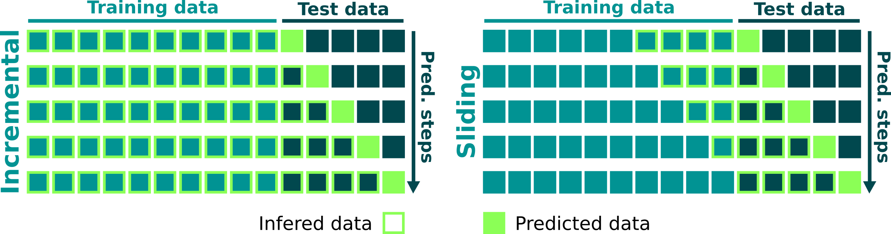

# PoC: Foundation Models for Time Series Forecasting 

This Proof of Concept aims to validate if a foundation model can achieve similar results when compared with state-of-the-art time series forecasting techniques.

## Table of Contents

- [PoC: Foundation Models for Time Series Forecasting](#poc-foundation-models-for-time-series-forecasting)
  - [Table of Contents](#table-of-contents)
  - [Data](#data)
    - [Chosen Data for experiments](#chosen-data-for-experiments)
    - [The dataset](#the-dataset)
      - [Data sample](#data-sample)
    - [Splitting the Dataset](#splitting-the-dataset)
    - [Granularity](#granularity)
  - [Chosen Model: Nixtla TimeGPT-1](#chosen-model-nixtla-timegpt-1)
  - [Experiments](#experiments)
    - [Inference Window](#inference-window)
    - [Baseline](#baseline)
    - [Metrics](#metrics)
  - [Results](#results)
    - [Predicted Range](#predicted-range)
    - [Baseline results vs. TimeGPT-1](#baseline-results-vs-timegpt-1)
    - [TimeGPT-1 vs. Measured data](#timegpt-1-vs-measured-data)
  - [Conclusion](#conclusion)
    - [Future Work](#future-work)
    - [References](#references)

## Data

### Chosen Data for experiments

The Santos-São Vicente-Bertioga Estuarine System (SSVBES), situated on the southeastern Brazilian coast, is influenced by three main forcing processes: astronomical tide, river discharge, and meteorological tide. The latter is driven by the synoptic winds that blow over the nearby continental shelf, following Ekman dynamics, and enter Santos Bay as gravity waves. When winds blow from the North-Northeast, meteorological tide results in a reduction of sea surface height (SSH); when winds blow from the South-Southwest, it leads to an increase in SSH [[1](#references)]. 

### The dataset

Our dataset spans **two years of data** from January 1, 2020, to December 31, 2021 (a total of 730 days) from the **Praticagem** measuring station from SSVBES. This location is equipped with sensors that collect measurements of oceanic variables: **SSH (Sea Surface Height)** and **water current speed**. For endogenous and exogenous data, we utilize numerical simulated data, specifically, **astronomical tide**. The input features contain *less than 4% missing data*. For this experiment, we *interpolated the missing data using a simple linear method* since the TimeGPT-1 model does not accept gaps in inference data. For a mature pipeline, a robust set of methods for filling data can and should be tested to verify the impact on prediction results.

#### Data sample

|      ds             |       y       |    ssh   |    at   | unique_id |
|---------------------|---------------|----------|---------|-----------|
| 2020-01-01 00:00:00 |   0.174852    |   0.70   | 0.779387| praticagem|
| 2020-01-01 01:00:00 |  -0.091108    |   0.66   | 0.653528| praticagem|
| 2020-01-01 02:00:00 |  -0.260948    |   0.48   | 0.502217| praticagem|
|        ...          |     ...       |    ...   |   ...   |    ...    |
| 2021-08-31 22:00:00 |   0.020116    |   0.47   | 0.819113| praticagem|
| 2021-08-31 23:00:00 |   0.108026    |   0.49   | 0.871922| praticagem|

<h4>Table 1: Sample o train dataset from Praticagem station.</h4>

where:

- `ds`: Datestamp
- `y`: Current Speed
- `ssh`: Sea Surface Height
- `at`: Astronomical tide
- `unique_id`: `id` to identify the region

### Splitting the Dataset

Furthermore, the dataset is split into two sequential sets: the train set and the test set. The train set comprises the first 20 months of the time series data, while the test set comprises the last 4 months.

### Granularity

The monitoring/simulated data was aggregated using a 60-minute step between windows, resulting in 3 measured points in the flow data for each hour. We chose this granularity due to the limitation of foundation models in handling long-term predictions (more than 24 forecast points).

## Chosen Model: Nixtla TimeGPT-1

Foundation models rely on their ability to generalize across different areas, especially with new data not present during training. In our quest for a foundation model capable of achieving results close to state-of-the-art forecasting methods using a zero-shot approach, we also considered the trade-off between accuracy and forecast generation time, as well as the challenge posed by limited availability of large data windows for training. It was during this search that we encountered a highly referenced model known as [TimeGPT-1](https://arxiv.org/abs/2310.03589). It leverages large public time series datasets to train TimeGPT-1, a Transformer-based model with self-attention mechanisms[[2](#references)]. It captures diverse temporal patterns across various domains by leveraging a diverse dataset. TimeGPT-1 employs an encoder-decoder structure with residual connections and layer normalization, generating forecasts based on historical values and local positional encoding. The model's attention-based mechanisms aim to accurately predict future distributions by capturing the diversity of past events[[2](#references)].

## Experiments

### Inference Window

In the paper [[1](#references)], a large inference windows (larger than 5k measured points) cannot be set due to computer resources limitations. The paper above uses 20 months of data to train the models and an inference window with 168 measured points (7 days) to forecast the next 24 hours using sliding windowing as we can see in [figure 1](#fig1). 
For the experiment, we used Nixtla TimeGPT-1 API to send data using incremental windowing to forecast the next 24 measured points ([figure 1](#fig1)). The incremental window was chosen to check the performance of the related model inferring a large data to be inferred. 

Given it involves zero-shot learning strategies, we propose investigating an optimal window that correlates window size with computational cost/tokens used for training/inference. **For this proof of concept inference using TimeGPT-1, we employed an incremental windowing strategy with padding = 1.** Here's how it works:

* **1st prediction step:**
    * **Inferred data:** N measurement points from the training series minus the last 23 points of the same series.
    * **Predicted data:** 24 points to be validated with the last 23 points of training plus the 1st measured point of the test series.  

* **2nd prediction step:** 
    * **Inferred data:** N measurement points from the training series minus the last 22 points of the same series.
    * **Predicted data:** 24 points to be validated with the last 22 points of training plus the first 2 measured points of the test series.  

* **24th prediction step:** 
    * **Inferred data:** Total of N measurement points from the training series.
    * **Predicted data:** 24 points to be validated with the first 24 points measured of the test series.

* **Last prediction step (2880th step):** 
    * **Inferred data:** Total of N measurement points from the training series plus N - 24 points of the test series.
    * **Predicted data:** 24 points to be validated with the last 24 points of the test series.

  

<h4>Figure 1: Types of Windowing</h4>

### Baseline

To measure the experiment results, we will use the paper [[1](#references)] as a baseline.

### Metrics

For all experiments, presented results using Index of Agreement (IoA)[[3](#references)] comparison metrics.

The Index of Agreement ($IoA$) is calculated using the formula:

$$
IoA = 1 - \frac{\sum_{i=1}^{n} (O_i - P_i)^2}{\sum_{i=1}^{n} (|P_i - \overline{O}| + |O_i - \overline{O}|)^2}
$$

where:
- $O_i$ represents the observed values,
- $P_i$ represents the predicted values,
- $\overline{O}$ is the mean of the observed values, and
- $n$ is the number of observations.

This formula assesses the agreement between observed and predicted values. A value of 1 indicates perfect agreement, while lower values indicate less agreement.

## Results

### Predicted Range

Due to computational resource limitations, only the first 20 days of the test dataset were generated. As a result, the metrics for prediction evaluation may exhibit disturbances compared to the benchmark data, which were compared with 4 months of data.

### Baseline results vs. TimeGPT-1

| Scenario               | IoA ↑     | Std. Error |
|------------------------|-----------|------------|
| SOFS (Num. Simul.)     | 0.812     | < 0.019    |
| SARIMAX - fixed        | 0.856     | < 0.019    |
| SARIMAX - reoptimized  | 0.859     | < 0.019    |
| GNN                    | 0.891     | < 0.019    |
| **TimeGPT-1**          | **0.954** | 0.031      |

<h4>Table 2: The performance results of forecasting methods for the Praticagem station, extracted from paper [<a href="#references">1</a>],
 are compared against the forecasting results from TimeGPT-1.
 (The highest IoA is highlighted in bold, indicating the best result).</h4>

### TimeGPT-1 vs. Measured data

<h4>Figure 2: All the predicted datestamp Current Velocity (m/s) from Praticagem using TimeGPT-1 vs. measured data.</h4>

## Conclusion
Table 2 shows that, despite having a higher standard deviation than the baseline model results, the experiment using TimeGPT-1 achieved a result approximately 7% better than the best result seen in [[1](#references)]. It is also worth noting that this PoC used only the time series from Praticagem and used only 3 features from the same region, in contrast to the baseline models that used other features and time series from other regions. In an initial analysis, we believe that the TimeGPT-1 model has great potential in predicting series of other features and correlated regions.

### Future Work

* Verify the API cost compared to ($) costs when training baseline models.
* Verify API usage with different prediction horizons and series from different regions.
* Evaluate the impact of using different endogenous/exogenous variables.
* Reproduce the results in [[1](#references)] using strictly the same features and data intervals.
* Compare the performance of TimeGPT-1 with other foundation models in the context of forecasting oceanographic variables.
* Use TimeGPT-1 as Teacher models in the Nexus model pipeline (distillation model).

### References

 

- [1] Fialho Coelho, Jefferson, et al. "Modeling Oceanic Variables With Graph-Guided Networks for Irregularly Sampled Multivariate Time Series." International Conference on Offshore Mechanics and Arctic Engineering. Vol. 86878. American Society of Mechanical Engineers, 2023. 
- [2] Liao, Wenlong, et al. "TimeGPT in Load Forecasting: A Large Time Series Model Perspective." arXiv preprint arXiv:2404.04885 (2024).
- [3] Willmott, Cort J. "On the validation of models." Physical geography 2.2 (1981): 184-194. 

## TODO tasks
- [ ] Create a plot:
  - [x] timeGPT
  - [ ] Chronos
- [ ] Check moving variance to check which points the models are good or bad to predict
- [ ] To fix model diagram for representing the loss calibration from teacher models
- [ ] Study: How to fine-tune chronos model?